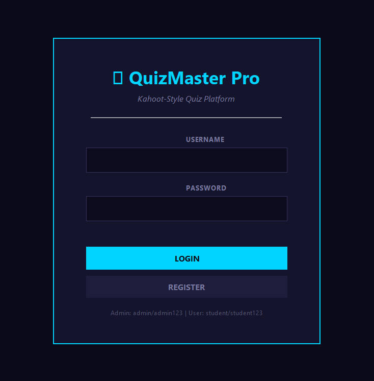
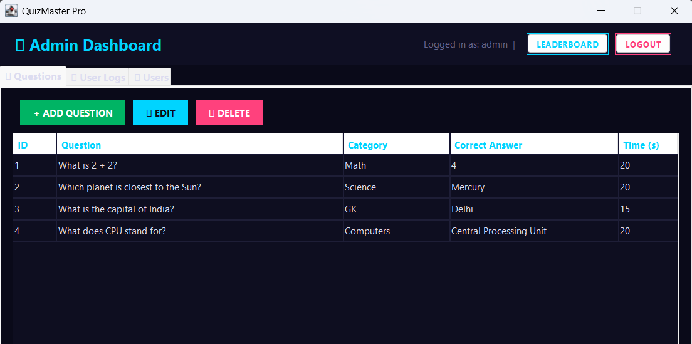
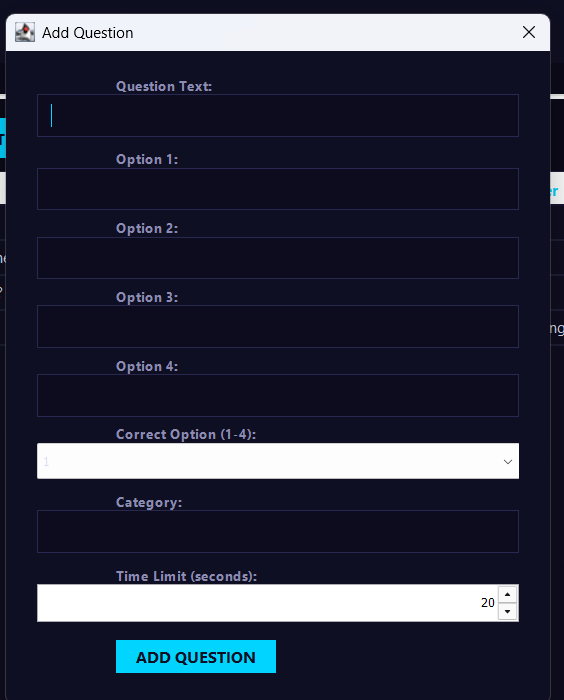
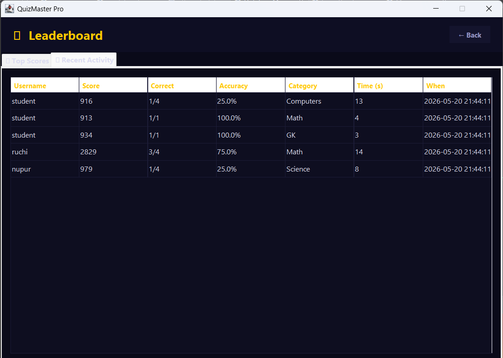

# QuizMaster Pro - Smart Quiz Management System

## Overview

QuizMater Pro is a modern desktop-based quiz management platform developed using Java Swing and Object-Oriented Programming principles. The system provides secure role-based access, quiz management functionality, leaderboard tracking, score analytics, and persistent file-based storage.

The application is inspired by modern quiz platforms and focuses on interactive UI design, modular architecture, and efficient quiz performance tracking.

---
## Project Highlights

- Built a desktop-based quiz platform inspired by modern online assessment systems.
- Integrated MySQL database using JDBC for persistent data storage.
- Implemented CRUD operations for question management and user administration.
- Developed leaderboard tracking and quiz analytics functionality.
- Applied Object-Oriented Programming principles with modular architecture.
  
---


## Features

- Secure Login & Registration System
- Role-Based Admin and Student Access
- Question Management (Add, Edit, Delete)
- MySQL Database Integration
- JDBC-Based Data Access Layer
- Leaderboard & Ranking System
- Real-Time Quiz Scoring
- Timed Quiz Assessments
- Quiz Attempt History Tracking
- Dark-Themed Interactive UI UI

---

## Tech Stack

- Java
- Java Swing
- JDBC
- MySQL
- SQL
- Object-Oriented Programming (OOP)
- Prepared Statements
---


## Project Structure

```text
quizmater-pro-java-system/
│
├── src/
│   ├── AdminPanel.java
│   ├── DatabaseManager.java
│   ├── LeaderboardPanel.java
│   ├── LoginPanel.java
│   ├── Main.java
│   └── other source files
│
├── screenshots/
│   ├── login-page.png
│   ├── admin-dashboard.png
│   ├── add-question.png
│   ├── leaderboard.png
│   └── quiz-result.png
│
├── README.md
└── .gitignore
```

---

## Database Setup

### Create Database

```sql
CREATE DATABASE quizmaster;
```

### Required Tables

- users
- questions
- quiz_attempts

Update database credentials inside:

```text
src/DatabaseManager.java
```

```java
private static final String URL = "jdbc:mysql://localhost:3306/quizmaster";
private static final String DB_USER = "root";
private static final String DB_PASS = "your_password";
```
## How to Run

1. Install MySQL Server and MySQL Workbench.
2. Create the `quizmaster` database.
3. Import the required tables.
4. Update database credentials in `DatabaseManager.java`.
5. Open the project in Eclipse or IntelliJ IDEA.
6. Run:

```text
src/Main.java
```

---

## Screenshots

### Login Page


### Admin Dashboard


### Add Question Panel


### Leaderboard


### Quiz Result Screen

## Key Functionalities

### Admin Features

- Manage quiz questions
- Monitor users
- View leaderboard analytics
- Track quiz attempts

### Student Features

- Attempt quizzes
- View rankings
- Analyze scores
- Track performance

---

## Learning Outcomes

- Java Swing GUI Development
- Event-Driven Programming
- File Handling & Data Persistence
- Object-Oriented Design
- UI/UX Structuring
- Java Collections & Data Management

---

## System Modules

### Admin Module

- Add Questions
- Edit Questions
- Delete Questions
- View Users
- Monitor Quiz Activity

### Student Module

- Register and Login
- Attempt Timed Quizzes
- View Scores
- Track Ranking

### Leaderboard Module

- Score Tracking
- User Ranking
- Attempt History

### Database Layer

- JDBC Connectivity
- MySQL Integration
- Prepared Statements
- CRUD Operations


## Future Improvements

- Database Integration using MySQL
- Online Multiplayer Quiz Mode
- REST API Integration
- Cloud Deployment
- Authentication Encryption
- Advanced Analytics Dashboard

---

## Author

### Ruchi Shukla

- GitHub: https://github.com/Ruchieyyy
- LinkedIn: https://www.linkedin.com/in/ruchi-shukla-731051309
